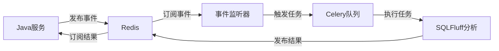

# SQLFluff事件驱动 + Celery混合架构

## 🎯 架构概述

本项目实现了**事件驱动 + Celery混合架构**，结合了两种技术的优势：

- **Redis事件系统**：实现服务间解耦和异步通信
- **Celery任务队列**：提供企业级特性（重试、监控、并发、可靠性）

## 🏗️ 架构流程

```
Java服务 → Redis事件 → 事件监听器 → Celery任务 → SQLFluff分析 → 结果事件 → Java服务
    ↓                      ↓              ↓                                     ↑
本地缓存              触发任务        企业级特性                           状态更新
```

## ✨ 核心特性

### 🔄 事件驱动解耦
- 服务间通过标准化事件通信
- 无直接依赖关系
- 支持异步处理

### 🚀 Celery企业级特性
- **自动重试**：失败任务自动重试，指数退避
- **并发控制**：多进程/线程并发处理
- **任务监控**：完整的任务状态跟踪
- **分布式队列**：支持多Worker水平扩展
- **可靠性保证**：任务持久化和确认机制

### 📊 统一处理模式
- 单SQL和ZIP包都转换为统一的单文件事件
- Worker只需处理一种事件类型
- 支持动态规则配置

## 🚀 快速开始

### 1. 环境准备

```bash
# 创建虚拟环境
python -m venv venv
source venv/bin/activate  # Linux/Mac
# 或 venv\Scripts\activate  # Windows

# 安装依赖
pip install -r requirements.txt

# 复制配置文件
cp .env.example .env
# 编辑 .env 文件，配置Redis等参数
```

### 2. 启动Redis

```bash
# 使用Docker启动Redis
docker run -d --name redis-sqlfluff -p 6379:6379 redis:7-alpine

# 或使用系统Redis
sudo systemctl start redis
```

### 3. 启动Worker

```bash
# 推荐：混合模式（事件监听器 + Celery Worker）
./scripts/start_hybrid_worker.sh hybrid

# 或分别启动
./scripts/start_hybrid_worker.sh event_listener  # 事件监听器
./scripts/start_hybrid_worker.sh celery_worker   # Celery Worker
```

### 4. 启动监控面板（可选）

```bash
# 启动Flower监控面板
./scripts/start_hybrid_worker.sh flower
# 访问: http://localhost:5555
```

## 📋 运行模式

| 模式 | 说明 | 适用场景 |
|------|------|----------|
| `hybrid` | 事件监听器 + Celery Worker | **推荐**，生产环境 |
| `event_listener` | 只运行事件监听器 | 调试事件处理 |
| `celery_worker` | 只运行Celery Worker | 调试任务执行 |
| `flower` | Flower监控面板 | 监控和管理 |

## 🔧 配置说明

### 环境变量配置

查看 `.env.example` 了解所有配置选项。

### 动态规则配置

支持在事件中动态指定SQLFluff规则：

```json
{
  "event_type": "SqlCheckRequested",
  "payload": {
    "rules": ["L001", "L032", "LT01"],              // 只启用这些规则
    "exclude_rules": ["L016", "L034"],              // 排除这些规则
    "config_overrides": {                           // 其他配置覆盖
      "max_line_length": 120,
      "capitalisation_policy": "lower"
    }
  }
}
```

## 📊 监控和管理

### Flower监控面板

```bash
./scripts/start_hybrid_worker.sh flower
```

访问 http://localhost:5555 查看：
- 任务执行状态
- Worker性能指标
- 队列统计信息
- 任务重试历史

### Celery命令行工具

```bash
# 查看Worker状态
./scripts/start_hybrid_worker.sh inspect

# 清空任务队列
./scripts/start_hybrid_worker.sh purge

# 查看事件监控
./scripts/start_hybrid_worker.sh monitor
```

## 🔍 故障排查

### 常见问题

1. **Redis连接失败**
   ```bash
   # 检查Redis状态
   redis-cli ping
   # 检查配置
   echo $CELERY_BROKER_URL
   ```

2. **任务不执行**
   ```bash
   # 检查队列状态
   celery -A app.celery_app.celery_main inspect active
   # 检查Worker状态
   celery -A app.celery_app.celery_main inspect stats
   ```

3. **事件监听器无响应**
   ```bash
   # 检查Redis订阅
   redis-cli monitor
   # 启动调试模式
   ./scripts/start_hybrid_worker.sh event_listener
   ```

### 日志检查

```bash
# Worker日志（实时）
tail -f logs/worker.log

# Celery任务日志
grep "Celery" logs/worker.log

# 事件处理日志
grep "Event" logs/worker.log
```

## 🎯 最佳实践

### 生产环境部署

1. **使用混合模式**
   ```bash
   ./scripts/start_hybrid_worker.sh hybrid
   ```

2. **配置多Worker实例**
   ```bash
   # 在不同服务器启动多个Worker
   ./scripts/start_hybrid_worker.sh hybrid
   ```

3. **启用监控**
   ```bash
   # 启动Flower监控
   ./scripts/start_hybrid_worker.sh flower
   ```

4. **配置日志轮转**
   - 使用logrotate管理日志文件
   - 配置适当的日志级别

### 性能优化

1. **调整并发数**
   ```bash
   # 根据CPU核心数调整
   export CELERY_WORKER_CONCURRENCY=8
   ```

2. **优化预取设置**
   ```bash
   # 减少内存占用
   export CELERY_WORKER_PREFETCH=1
   ```

3. **监控Redis性能**
   ```bash
   redis-cli info stats
   ```

## 🔄 升级迁移

从纯事件驱动架构升级到混合架构：

1. **安装新依赖**
   ```bash
   pip install -r requirements.txt
   ```

2. **更新配置**
   ```bash
   cp .env.example .env
   # 配置Redis连接信息
   ```

3. **启动新架构**
   ```bash
   ./scripts/start_hybrid_worker.sh hybrid
   ```

4. **验证功能**
   - 检查事件处理正常
   - 确认任务重试机制工作
   - 验证监控面板访问

## 📚 技术架构

### 事件流程



### 组件职责

- **事件监听器**：监听Redis事件，触发Celery任务
- **Celery Worker**：执行SQL分析任务，提供企业级特性
- **Redis**：事件消息队列和Celery任务代理
- **SQLFluff服务**：SQL分析核心逻辑，支持动态规则

---

🎉 **现在你拥有了一个结合事件驱动解耦性和Celery企业级特性的强大架构！** 


# 启动Flower监控面板
./scripts/start_hybrid_worker.sh flower

# 启动Worker（另一个终端）
./scripts/start_hybrid_worker.sh hybrid