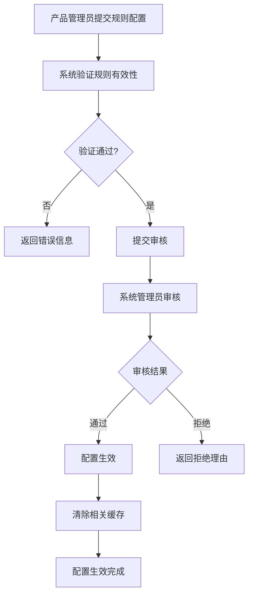

# SQLFluff 规则码表管理方案设计文档

## 1. 需求分析

### 1.1 当前架构
- **前端** → **Java微服务** → **Python服务**(接收rules[]) → **SQLFluff执行**
- 规则通过API参数直接传递，缺乏统一管理机制

### 1.2 目标架构
- **前端**(传入product_name) → **Java微服务**(规则解析: product_name+dialect→rules[]) → **Python服务** → **SQLFluff执行**
- Python服务零改动，Java微服务承担规则管理职责

### 1.3 核心需求
- **系统管理员**: 为每个方言配置默认规则组
- **产品管理员**: 为产品配置个性化规则（添加/排除）
- **审核机制**: 产品个性化配置需要审核
- **降级策略**: 规则解析失败时使用默认规则

## 2. 方案问题分析

### 2.1 设计缺陷

#### 🚨 **严重问题**
1. **规则冲突处理不明确**
   - 默认规则与用户规则冲突时的处理逻辑缺失
   - 添加规则与排除规则的优先级未定义

2. **方言兼容性风险**
   - 不同方言的规则集合差异巨大
   - 跨方言规则迁移可能导致执行失败

3. **审核流程设计不完整**
   - 审核标准和流程未明确
   - 审核失败后的回滚机制缺失

#### ⚠️ **潜在问题**
4. **性能瓶颈**
   - 每次检查都需要查询和计算规则配置
   - 缺乏有效的缓存策略

5. **版本兼容性**
   - SQLFluff版本升级时规则可能变化或废弃
   - 历史规则配置的兼容性维护困难

6. **权限管理粗糙**
   - 缺乏细粒度的权限控制
   - 操作审计和历史追溯机制缺失

### 2.2 架构风险

7. **单点故障**
   - 规则配置服务故障将影响所有检查任务
   - 缺乏降级和熔断机制

8. **数据一致性**
   - 分布式环境下规则配置的一致性难以保证
   - 规则变更的原子性操作缺失

## 3. 改进方案设计

### 3.1 整体架构

```
┌─────────────────┐    ┌──────────────────┐    ┌─────────────────┐
│   前端管理界面   │───▶│   Java微服务     │───▶│  规则配置数据库  │
│   规则配置      │    │   规则管理API    │    │                │
└─────────────────┘    └──────────────────┘    └─────────────────┘
                              │
                              ▼
┌─────────────────┐    ┌──────────────────┐    ┌─────────────────┐
│   Python服务    │◀───│   规则解析引擎   │───▶│   Redis缓存     │
│   SQLFluff执行  │    │   配置计算       │    │   规则配置      │
└─────────────────┘    └──────────────────┘    └─────────────────┘
```

### 3.2 核心数据模型

#### 3.2.1 规则定义表 (rule_definitions)
```sql
CREATE TABLE rule_definitions (
    id BIGINT PRIMARY KEY AUTO_INCREMENT,
    rule_code VARCHAR(50) NOT NULL,
    rule_name VARCHAR(200) NOT NULL,
    description TEXT,
    supported_dialects JSON,
    sqlfluff_version VARCHAR(20),
    severity ENUM('ERROR', 'WARNING', 'INFO'),
    category VARCHAR(100),
    is_active BOOLEAN DEFAULT TRUE,
    created_at TIMESTAMP DEFAULT CURRENT_TIMESTAMP,
    updated_at TIMESTAMP DEFAULT CURRENT_TIMESTAMP ON UPDATE CURRENT_TIMESTAMP,
    UNIQUE KEY uk_rule_code (rule_code)
);
```

#### 3.2.2 默认规则组表 (default_rule_groups)
```sql
CREATE TABLE default_rule_groups (
    id BIGINT PRIMARY KEY AUTO_INCREMENT,
    dialect VARCHAR(50) NOT NULL,
    rule_code VARCHAR(50) NOT NULL,
    is_enabled BOOLEAN DEFAULT TRUE,
    priority INT DEFAULT 0,
    created_by VARCHAR(100),
    created_at TIMESTAMP DEFAULT CURRENT_TIMESTAMP,
    updated_at TIMESTAMP DEFAULT CURRENT_TIMESTAMP ON UPDATE CURRENT_TIMESTAMP,
    UNIQUE KEY uk_dialect_rule (dialect, rule_code),
    FOREIGN KEY (rule_code) REFERENCES rule_definitions(rule_code)
);
```

#### 3.2.3 产品规则配置表 (product_rule_configs)
```sql
CREATE TABLE product_rule_configs (
    id BIGINT PRIMARY KEY AUTO_INCREMENT,
    product_id VARCHAR(100) NOT NULL,
    dialect VARCHAR(50) NOT NULL,
    config_name VARCHAR(200) NOT NULL,
    config_type ENUM('INCLUDE', 'EXCLUDE') NOT NULL,
    rule_code VARCHAR(50) NOT NULL,
    status ENUM('DRAFT', 'PENDING', 'APPROVED', 'REJECTED') DEFAULT 'DRAFT',
    created_by VARCHAR(100),
    approved_by VARCHAR(100),
    approved_at TIMESTAMP NULL,
    created_at TIMESTAMP DEFAULT CURRENT_TIMESTAMP,
    updated_at TIMESTAMP DEFAULT CURRENT_TIMESTAMP ON UPDATE CURRENT_TIMESTAMP,
    INDEX idx_product_dialect (product_id, dialect),
    FOREIGN KEY (rule_code) REFERENCES rule_definitions(rule_code)
);
```

### 3.3 规则解析算法

#### 3.3.1 规则合并策略

```java
public class RuleResolver {
    
    public Set<String> resolveRules(String productId, String dialect) {
        // 1. 获取默认规则组
        Set<String> defaultRules = getDefaultRules(dialect);
        
        // 2. 获取产品规则配置
        List<ProductRuleConfig> productConfigs = getProductRules(productId, dialect);
        
        // 3. 应用产品规则（排除规则）
        Set<String> excludeRules = productConfigs.stream()
            .filter(config -> config.getType() == EXCLUDE && config.getStatus() == APPROVED)
            .map(ProductRuleConfig::getRuleCode)
            .collect(Collectors.toSet());
        defaultRules.removeAll(excludeRules);
        
        // 4. 应用产品规则（包含规则）
        Set<String> includeRules = productConfigs.stream()
            .filter(config -> config.getType() == INCLUDE && config.getStatus() == APPROVED)
            .map(ProductRuleConfig::getRuleCode)
            .filter(rule -> isRuleCompatibleWithDialect(rule, dialect))
            .collect(Collectors.toSet());
        defaultRules.addAll(includeRules);
        
        return defaultRules;
    }
}
```

#### 3.3.2 缓存策略

```java
@Service
public class RuleCacheService {
    
    @Cacheable(value = "product-rules", key = "#productId + ':' + #dialect")
    public Set<String> getCachedRules(String productId, String dialect) {
        return ruleResolver.resolveRules(productId, dialect);
    }
    
    @CacheEvict(value = "product-rules", allEntries = true)
    public void evictRulesCache() {
        // 规则配置变更时清除缓存
    }
}
```

### 3.4 审核工作流

#### 3.4.1 审核流程设计



#### 3.4.2 规则验证机制

```java
@Component
public class RuleValidator {
    
    public ValidationResult validateRuleConfig(ProductRuleConfig config) {
        ValidationResult result = new ValidationResult();
        
        // 1. 验证规则代码是否存在
        if (!ruleDefinitionService.exists(config.getRuleCode())) {
            result.addError("规则代码不存在: " + config.getRuleCode());
        }
        
        // 2. 验证方言兼容性
        if (!isRuleCompatibleWithDialect(config.getRuleCode(), config.getDialect())) {
            result.addError("规则与方言不兼容");
        }
        
        // 3. 验证规则冲突
        List<String> conflicts = findRuleConflicts(config);
        if (!conflicts.isEmpty()) {
            result.addWarning("存在规则冲突: " + String.join(", ", conflicts));
        }
        
        return result;
    }
}
```

### 3.5 API设计

#### 3.5.1 规则管理API

```java
@RestController
@RequestMapping("/api/rules")
public class RuleManagementController {
    
    // 获取产品规则配置
    @GetMapping("/products/{productId}/config")
    public ResponseEntity<RuleConfigResponse> getProductRuleConfig(
            @PathVariable String productId,
            @RequestParam String dialect) {
        Set<String> rules = ruleService.getProductRules(productId, dialect);
        return ResponseEntity.ok(new RuleConfigResponse(rules));
    }
    
    // 创建/更新产品规则配置
    @PostMapping("/products/{productId}/config")
    public ResponseEntity<ApiResponse> updateProductRuleConfig(
            @PathVariable String productId,
            @RequestBody ProductRuleConfigRequest request) {
        // 验证和保存配置
        ValidationResult validation = ruleValidator.validateRuleConfig(request);
        if (validation.hasErrors()) {
            return ResponseEntity.badRequest().body(new ApiResponse(validation.getErrors()));
        }
        
        ruleService.saveProductRuleConfig(productId, request);
        return ResponseEntity.ok(new ApiResponse("配置提交成功，等待审核"));
    }
    
    // 审核规则配置
    @PostMapping("/config/{configId}/approve")
    public ResponseEntity<ApiResponse> approveRuleConfig(
            @PathVariable Long configId,
            @RequestBody ApprovalRequest request) {
        ruleService.approveRuleConfig(configId, request.getApproved(), request.getComment());
        return ResponseEntity.ok(new ApiResponse("审核完成"));
    }
}
```

#### 3.5.2 Python服务集成

```python
# 在现有的 JobCreateRequest 中添加 product_id
class JobCreateRequest(BaseModel):
    # ... 现有字段
    product_id: Optional[str] = None  # 新增产品ID字段
    
# 修改 SQLFluffService
class SQLFluffService:
    def __init__(self):
        self.rule_client = RuleManagementClient()
    
    async def analyze_sql_content(self, sql_content: str, file_name: str = "query.sql", 
                                 dialect: Optional[str] = None, 
                                 product_id: Optional[str] = None,
                                 rules: Optional[List[str]] = None) -> Dict[str, Any]:
        # 如果提供了 product_id，则从规则管理服务获取规则
        if product_id and not rules:
            try:
                rules = await self.rule_client.get_product_rules(product_id, dialect)
                self.logger.info(f"获取产品规则: {product_id}, 规则数量: {len(rules)}")
            except Exception as e:
                self.logger.warning(f"获取产品规则失败，使用默认规则: {e}")
                rules = None
        
        # 继续现有逻辑...
```

### 3.6 降级和熔断机制

#### 3.6.1 熔断器实现

```java
@Component
public class RuleServiceCircuitBreaker {
    
    @CircuitBreaker(name = "rule-service", fallbackMethod = "fallbackGetRules")
    public Set<String> getRules(String productId, String dialect) {
        return ruleManagementService.getProductRules(productId, dialect);
    }
    
    public Set<String> fallbackGetRules(String productId, String dialect, Exception ex) {
        // 降级策略：使用默认规则
        logger.warn("规则服务不可用，使用默认规则: {}", ex.getMessage());
        return defaultRuleService.getDefaultRules(dialect);
    }
}
```

#### 3.6.2 缓存降级策略

```python
class RuleManagementClient:
    def __init__(self):
        self.redis_client = redis.Redis()
        self.local_cache = {}
        
    async def get_product_rules(self, product_id: str, dialect: str) -> List[str]:
        cache_key = f"rules:{product_id}:{dialect}"
        
        try:
            # 1. 优先从 Redis 缓存获取
            cached_rules = await self.redis_client.get(cache_key)
            if cached_rules:
                return json.loads(cached_rules)
                
            # 2. 从规则管理服务获取
            rules = await self._fetch_from_service(product_id, dialect)
            await self.redis_client.setex(cache_key, 3600, json.dumps(rules))
            return rules
            
        except Exception as e:
            # 3. 降级到本地缓存
            if cache_key in self.local_cache:
                self.logger.warning(f"使用本地缓存规则: {e}")
                return self.local_cache[cache_key]
                
            # 4. 最终降级到默认规则
            self.logger.error(f"规则获取失败，使用默认规则: {e}")
            return self._get_default_rules(dialect)
```

## 4. 实施建议

### 4.1 分阶段实施

#### 第一阶段：基础架构搭建（2-3周）
- [ ] 建立规则定义表和基础数据
- [ ] 实现规则管理基础API
- [ ] 建立缓存机制
- [ ] 实现Python服务集成

#### 第二阶段：审核工作流（2周）
- [ ] 实现规则配置审核流程
- [ ] 建立规则验证机制
- [ ] 实现规则冲突检测

#### 第三阶段：高级特性（2-3周）
- [ ] 实现熔断和降级机制
- [ ] 完善监控和告警
- [ ] 建立操作审计日志

### 4.2 关键成功因素

1. **数据质量**: 确保规则定义数据的准确性和完整性
2. **性能优化**: 建立有效的多级缓存策略
3. **稳定性**: 实现完善的降级和熔断机制
4. **可观测性**: 建立全链路监控和告警

### 4.3 风险控制

1. **渐进式迁移**: 先在测试环境验证，再逐步推广到生产
2. **回滚方案**: 保留直接传递规则的兼容模式
3. **性能测试**: 进行充分的压力测试和性能调优
4. **应急预案**: 建立规则服务故障的应急处理流程

## 5. 总结

本方案通过引入规则码表管理系统，解决了当前SQLFluff规则管理的痛点，提供了：

- **灵活性**: 支持多层次的规则配置
- **可靠性**: 完善的降级和熔断机制
- **可维护性**: 清晰的数据模型和审核流程
- **可扩展性**: 支持未来的功能扩展

建议采用分阶段实施的方式，确保系统的稳定性和可靠性。