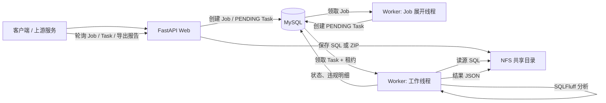
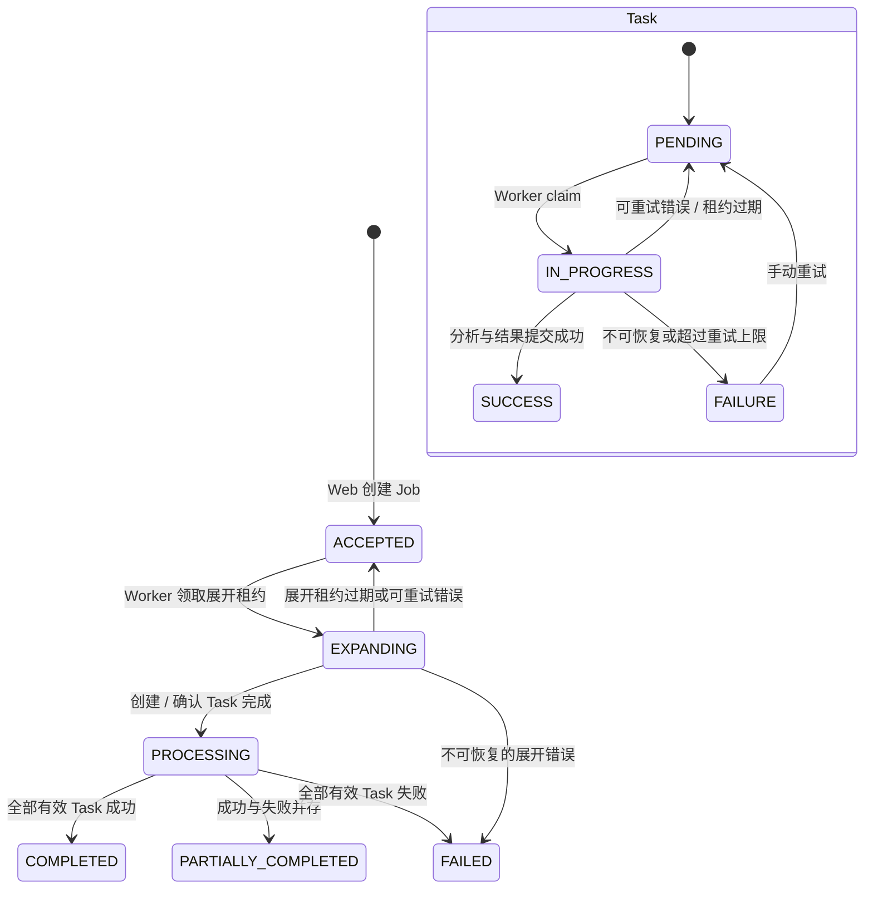

# 任务接收、派发与处理说明

本文说明 SQL 核验服务中异步任务从接收请求到产出结果的完整链路。项目使用 **DB-as-Queue** 模型：MySQL 中的 `linting_jobs` 和 `linting_tasks` 既保存业务数据，也承担队列职责；运行时不依赖 Celery 或 Redis。

## 1. 参与组件与职责

| 组件 | 职责 |
| --- | --- |
| FastAPI Web | 接收 HTTP 请求、校验参数、将输入文件写入 NFS、创建 Job / Task 数据。 |
| MySQL | 持久化 Job、Task、违规明细、Worker 心跳和租约；通过行锁协调多 Worker 消费。 |
| NFS 共享目录 | 存储提交的 SQL / ZIP、ZIP 解压内容及 Task 的分析结果 JSON；Web 和 Worker 必须使用同一个挂载路径。 |
| DB Worker | 展开批量 Job、领取 Task、调用 SQLFluff、保存结果、续租及故障回收。 |



## 2. 任务接收：HTTP 请求如何变成 Job

业务接口前缀为 `/api/v1`，异步入口均返回 `202 Accepted` 和 `job_id`：

| 入口 | 输入形式 | Web 侧动作 |
| --- | --- | --- |
| `POST /jobs` | `sql_content`，或 NFS 中已有的 `zip_file_path` | 创建 Job；单段 SQL 写入 NFS。 |
| `POST /jobs/upload` | 表单中的 `sql_content` 或 ZIP 文件 | ZIP 先保存至 `NFS_SHARE_ROOT_PATH/uploads/`，再创建 Job。 |
| `POST /jobs/create-from-extracted` | NFS 中已解压目录路径 | 校验目录存在后创建 Job，后续扫描交由 Worker。 |

创建时会生成对外的 `job_id`，在 `linting_jobs` 中保存以下关键信息：提交类型、源路径、SQL 方言、规则列表、用户及产品信息。初始状态均为 `ACCEPTED`。

单段 SQL 与批量提交的区别如下：

- 单段 SQL：`JobService` 在创建 Job 的同一数据库事务中创建一个 `PENDING` 的文件级 Task。
- ZIP 或已解压目录：创建时不扫描文件、不建 Task；Job 保持 `ACCEPTED`，由 Worker 的 Job 展开线程异步完成扫描或解压。

`POST /sql/check` 是另一条同步通路：它直接在隔离子进程中分析请求里的 SQL，不创建 Job 或 Task，也不会经过队列。

## 3. 任务派发：Job 展开为文件级 Task

每个 Worker 进程有一个独立的 **Job 展开线程**，持续从 `ACCEPTED` Job 中领取待展开工作。独立线程避免大量文件级 Task 堆积时，批量 Job 无法被展开。

领取过程在数据库事务内执行：

1. 按 `created_at`、`id` 排序查询一个 `ACCEPTED` Job，并使用 `SELECT ... FOR UPDATE SKIP LOCKED` 加锁。
2. 将 Job 原子更新为 `EXPANDING`，并写入 `expansion_lease_token` 与 `expansion_lease_expires_at`。
3. 根据提交类型处理输入：
   - ZIP：解压到 `jobs/<job_id>/extracted`，取得其中的 SQL 文件；
   - 已解压目录：递归列出 SQL 文件；
   - 单段 SQL：若尚未创建 Task 则补建一个（通常已由 Web 创建）。
4. 为每个尚未存在的 `source_file_path` 创建 `linting_tasks` 记录，初始状态为 `PENDING`。
5. 持有正确展开租约时，将 Job 更新为 `PROCESSING` 并清除展开租约。

展开按源文件路径去重，因此 Worker 在展开过程中崩溃后，重新展开同一 Job 时只会补建缺失的 Task，不会重复创建已有文件任务。

## 4. Task 派发：Worker 如何安全领取任务

每个 Worker 进程启动 `WORKER_CONCURRENCY` 个工作线程。每个线程循环执行“领取 → 处理 → 再领取”；没有可用任务时等待 `WORKER_POLL_INTERVAL` 秒。

领取条件与排序为：

```sql
status = 'PENDING'
AND (next_attempt_at IS NULL OR next_attempt_at <= NOW())
ORDER BY priority DESC, created_at ASC, id ASC
FOR UPDATE SKIP LOCKED
```

领取成功后，当前 Worker 在同一事务中将 Task 更新为：

- `status = IN_PROGRESS`；
- 增加 `attempt_count`（并同步兼容字段 `retry_count`）；
- 写入唯一的 `lease_token`、`claim_id`、`claimed_at`、`started_at`；
- 写入 `lease_expires_at`；
- 清理上一次的错误信息。

`SKIP LOCKED` 使多个进程或线程可以并发领取：已被其他消费者锁住的记录会被跳过，避免同一 Task 被同时处理。优先级数值越大越先执行，同一优先级按创建时间先进先出。

## 5. Task 处理与结果提交

已领取的 Task 会启动一个后台续租线程；该线程每隔 `WORKER_LEASE_RENEW_INTERVAL` 秒更新一次租约。实际处理流程如下：

1. 从数据库加载 Task 和关联 Job。
2. 依据 `source_file_path` 从 NFS 校验并读取 SQL 文件。
3. 在独立子进程中执行 SQLFluff 分析，以隔离超时或失控的分析进程。
4. 使用 `rule_definitions` 中的规则映射补充违规的严重级别。
5. 将完整分析结果原子写到 NFS：`results/<job_id>/<task_id>/<lease_token>.json`。
6. 在一个带租约校验的数据库事务中：删除该 Task 的旧违规明细、写入新的 `linting_violations`、更新违规统计，并将 Task 改为 `SUCCESS`。
7. 清除租约字段，更新父 Job 的聚合状态，并清理由旧租约遗留的结果 JSON。

第 6 步使用 `task_id + IN_PROGRESS + lease_token` 作为更新条件（fencing）。若 Worker 在处理期间失去租约，即使其分析已结束，也不能覆盖后来重新领取该 Task 的 Worker 的结果。

## 6. 状态流转与 Job 聚合



Job 状态由其 Task 聚合得出：只要仍有 `PENDING` 或 `IN_PROGRESS`，Job 为 `PROCESSING`；全部成功为 `COMPLETED`；成功与失败混合为 `PARTIALLY_COMPLETED`；全部失败为 `FAILED`。由于 Task 成功提交与 Job 聚合是两个事务，租约扫描线程还会定期修复“Task 已全部终态但 Job 仍是 `PROCESSING`”的短暂不一致。

## 7. 失败、重试与恢复

### 自动重试

处理异常会被归类为不可恢复或可重试：例如文件不存在、无效 SQL 文件或不支持的方言会直接进入 `FAILURE`；超时、连接、NFS、数据库等暂时性错误会重新进入 `PENDING`。可重试任务会按指数退避并添加随机抖动，写入 `next_attempt_at`；到达 `WORKER_MAX_RETRIES` 上限后转为 `FAILURE`。

### 租约回收

每个 Worker 还包含一个租约扫描线程，按 `WORKER_ZOMBIE_SWEEP_INTERVAL` 定期执行：

- 回收 `lease_expires_at` 已过期的 `IN_PROGRESS` Task，并按同一重试策略转为 `PENDING` 或 `FAILURE`；
- 回收展开租约过期的 `EXPANDING` Job，将其重置为 `ACCEPTED` 以便再次展开；
- 协调已全部终态但状态仍为 `PROCESSING` 的 Job。

Worker 心跳超时只会将 `worker_registry` 中的 Worker 标记为 `DEAD`，不会直接回收其 Task；Task 的可恢复性以租约是否过期为准。

### 人工重试

`POST /tasks/retry` 仅/违规统计及违规明细，将 Task 重置为可立即领取的 `PENDING`，并把父 Job 调整为 `PROCESSING`。人工重试会将自动重试计数清零。

## 8. 结果获取与观测

客户端可轮询 `GET /jobs?job_id=...` 查看 Job 状态和子任务摘要，或通过 `GET /tasks?task_id=...` 查询单个 Task。Task 成功后可读取：

- `GET /tasks/result`：完整结果 JSON；
- `GET /tasks/result/lint`：违规与对应 SQL 行；
- `GET /tasks/result/download`：下载结果文件；
- Job 级违规、统计及 CSV / HTML 导出接口。

任务尚处于 `PENDING` 或 `IN_PROGRESS` 时读取结果会返回 `409 Conflict`；失败 Task 会返回失败原因。

建议通过 `/api/v1/health/metrics` 观察队列。重点指标包括待领取任务数、最老待处理任务年龄、活跃 Worker 数、过期租约次数、重试次数和处理耗时。指标定义及告警建议见 [queue_metrics.md](queue_metrics.md)。

## 9. 关键配置

| 配置 | 默认值 | 对链路的影响 |
| --- | ---: | --- |
| `WORKER_CONCURRENCY` | `4` | 每个 Worker 进程的文件级 Task 并发线程数。 |
| `WORKER_POLL_INTERVAL` | `2.0s` | 无可领取 Task 时的轮询间隔。 |
| `WORKER_TASK_LEASE_SECONDS` | `120s` | Task 独占处理租约时长。 |
| `WORKER_LEASE_RENEW_INTERVAL` | `40s` | 任务执行期间的续租间隔，必须小于 Task 租约。 |
| `WORKER_MAX_RETRIES` | `3` | 自动重试的最大尝试次数。 |
| `WORKER_MAX_BACKOFF_SECONDS` | `300s` | 重试退避的最大等待时间。 |
| `WORKER_JOB_EXPANSION_LEASE_SECONDS` | `600s` | Job 展开租约时长。 |
| `WORKER_JOB_EXPANSION_POLL_INTERVAL` | `2.0s` | Job 展开线程的轮询间隔。 |
| `NFS_SHARE_ROOT_PATH` | 无 | SQL、ZIP、解压内容和结果 JSON 的共享根目录。 |

`WORKER_ANALYZE_SOFT_TIMEOUT` 必须小于 `WORKER_ANALYZE_HARD_TIMEOUT`，并且续租间隔必须小于 Task 租约；否则 Worker 启动时会拒绝该配置。

## 10. 相关实现位置

| 逻辑 | 主要代码 |
| --- | --- |
| HTTP 任务接收 | `app/api/routes/jobs.py`、`app/services/job_service.py` |
| Job 展开与幂等建 Task | `app/worker/job_processor.py` |
| Task 领取、心跳、续租与回收 | `app/worker/loop.py` |
| SQLFluff 分析、结果与违规提交 | `app/worker/processor.py` |
| 失败分类与退避 | `app/worker/retry.py` |
| Job 状态聚合和对账 | `app/services/job_status.py` |
| 手工重试 | `app/api/routes/tasks.py`、`app/services/task_service.py` |
